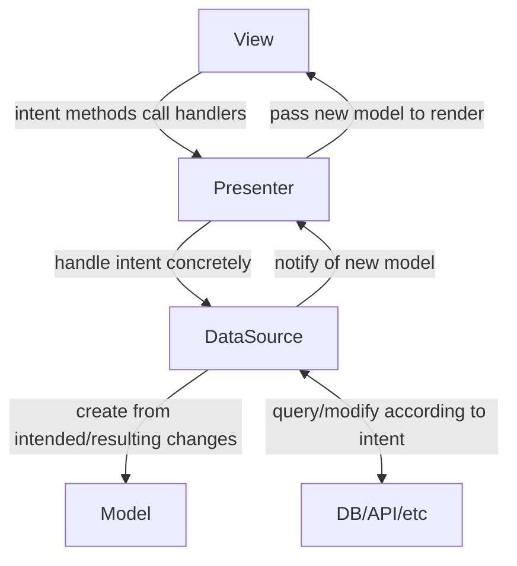

# flet-mvp-utils

- [flet-mvp-utils](#flet-mvp-utils)
  - [Architecture](#architecture)
  - [Usage](#usage)
    - [View](#view)
    - [Presenter](#presenter)
    - [DataSource](#datasource)
    - [Model](#model)
    - [Validation / error handling](#validation--error-handling)

This library provides tools that make it a bit easier
to follow architecture patterns in your flet app
that leverage on immutable models and unidirectional control flow.
Those are mostly based on the Model-View-Presenter/MVP pattern,
hence the name of the library.
At this stage,
it can be used to ease working with any model-based architecture pattern though.

## Architecture



## Usage

Say you have a form and want to validate the TextFields in it
when a submit button is clicked.

### View

Your view uses [refs](https://flet.dev/docs/guides/python/control-refs/).
The actual UI code may be located somewhere else
and simply receive the refs and return a component that is connected to the ref.
When creating the view class, you inherit from `MvpView`
and in your `__init__.py`, you create a dictionary that maps the attribute names
of your model to the respective ref
of the control that should be tied to it.
You then pass this dictionary to `super().__init__()`,
along with any variable intended for the `flet.View` constructor.

```python
import flet as ft

from flet_mvp_utils import MvpView


class FormView(MvpView):
    def __init__(self, route: str)
        self.ref_map = {
            "last_name": ft.Ref[ft.TextField]()
            "first_name": ft.Ref[ft.TextField]()
            "age": ft.Ref[ft.TextField]()
        }
        super().__init__(
            ref_map=self.ref_map,
            route=route
        )

```

`MvpView` has a `render(model)` method that takes a model
and updates any refs' current value to the model value if they aren't the same.
This method is supposed to be called in the callback
you register with the DataSource,
so that a changed model is immediately reflected in the view.

### Presenter

Any class that inherits from `MvpPresenter` updates the view automatically
once it is notified of a model update.
Since it will be given both the View and the DataSource upon creation,
it can easily do this in its `__init__()` method.

```python
from flet_mvp_utils import MvpPresenter


class FormPresenter(MvpPresenter):
    def __init__(self, data_source: FormDataSource, view: FormViewProtocol):
        self.data_source = data_source
        self.view = view

        super().__init__(self.data_source, self.view)
```

`MvpPresenter` also provides a generic `build()` method
that simply calls the `build(presenter)` method of the view
with itself as the sole argument.
If you need a custom build method for your presenter,
just override it with your own.

### DataSource

The DataSource class, inheriting from `MvpDataSource`,
is where the business logic of your component/virtual page will live.
Since the latter inherits from `Observable`,
brokers of any kind (presenter classes in MVP-based architectures)
can register callback functions with your DataSource class
that will be executed when you call `self.notify_observers()` in it.
As mentioned above, subclasses of `MvpPresenter` do this for you automatically
after you initialized them properly.

These callbacks are meant to be used to inform a presenter that a new,
updated model has been created.
Since creating and updating a model is a rather repetitive and uniform task,
`MvpDataSource` will do it for you.
All you have to do is pass your model class to its constructor
and call `self.update_model_partial(changes: dict)`
or `self.update_model_complete(new_model: dict)` depending on your use case.

```python
from flet_mvp_utils import MvpDataSource


class FormDataSource(MvpDataSource):
    def __init__(self, ...):
        super().__init__(FormModel)
```

You will also see that after intitializing the superclass,
your DataSource will have a `self.current_model` attribute.
While you can be sure that this is a pydantic BaseModel,
it is typed as `Any` to avoid typechecking troubles.

### Model

The model is supposed to act as the state of your view.
It should contain everything the view needs to know
in order to render/update itself.
This can be data from a database, an API,
a config file or even just another component.

Your model inherits from `MvpModel`,
which is an immutable pydantic BaseModel.
This means you can write custom validators for each attribute
and validate all your data whenever a new instance of the model is created.

The model is immutable to force good habits upon the ones using it.
Good habits in this context means not to modify your current model anywhere
but in your DataSource class as that should be the single source of truth.
Of course immutability is never enforced 100% in python,
but this should suffice.

```python
from flet_mvp_utils import MvpModel


class FormModel(MvpModel):
    last_name: str = ""
    first_name: str = ""
    age: int = 0
```

### Validation / error handling

Notice that `age` is an `int`,
even though the ref we assigned to it earlier points to a TextField?
That's no problem at all,
you'll have to do no manual conversion.
Pydantic will parse the text input into an `int`
and raise an error if that fails.
We probably want to inform our user though that they have input invalid data.
To do this, we'll simply typehint `age` differently.

```python
from flet_mvp_utils import ErrorMessage, MvpModel


class FormModel(MvpModel):
    last_name: str = ""
    first_name: str = ""
    age: ErrorMessage | int = 0
```

> It's important to specify the narrower type (ErrorMessage) first,
> otherwise every error message would just say
> that the field is not an instance of ErrorMessage.

This is where the magic of the update_model methods of `MvpDataSource` comes to light.
If the creation of a new model fails,
e.g. because a user put "old" into the age TextField instead of a number,
our DataSource will now catch this error,
wrap its message in an `ErrorMessage` object
and assign it to the age field.
Multiple errors at once are no problem at all,
each ErrorMessage will be assigned to the field that caused it.

Since we probably don't want to make any calls to a database, API etc. in that case,
the update_model methods will return a bool
to let you know if there was an error.

The subscribed observers will be notified either way
and the model will thus be rendered.
`MvpView.render()` will try to assign fields that are instances of `ErrorMessage`
to the `error_text` property of the control that the associated ref points to.
This means that you should only use this technique for model fields
that are associated with controls that actually have that property,
like TextField or Dropdown.
